# Quick Start

```{note}
QHAna can be tested in a local docker-compose setup.
```

## Settings


After starting the docker compose file open the QHAna UI and go to the settings page by clicking on the gear icon in the top right corner or directly opening http://localhost:8080/#/settings in the browser.
All the settings should be configured as in the screenshots below.

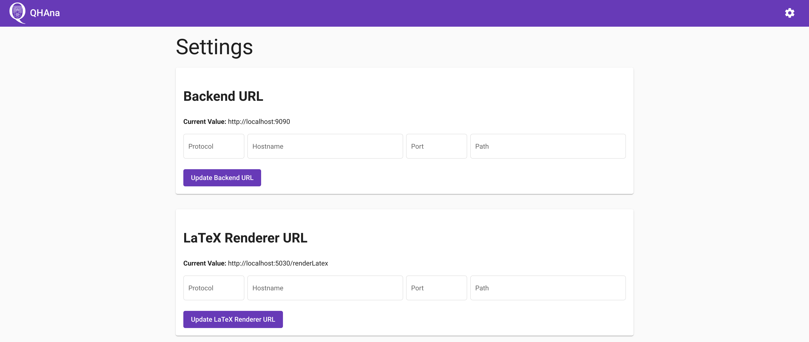
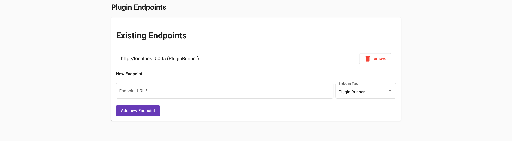

Navigate back by using the browser history or clicking on the QHAna logo in the top left corner.

```{hint}
If you have changed the port of the QHAna backend or are using a different backend, then you can change the backend URL at the top.
The setting will be saved in the browser local storage on your device.
To reset this setting just empty all form fields and click on the "Update Backend URL" button.
```


## The First Experiment

First create a new experiment by clicking on the "New Experiment" button and filling out the dialog.
Submitting the dialog will automatically open the new experiment.

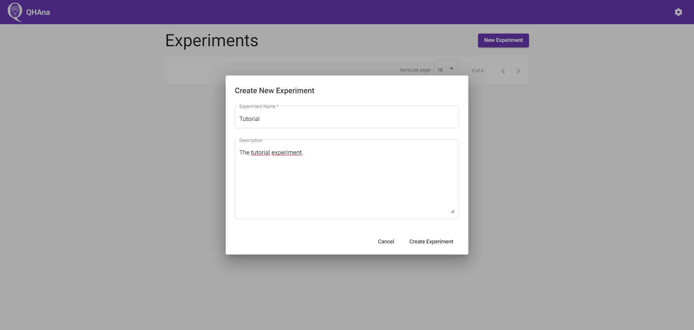

The currently selected experiment name is always shown in the top right corner.
To select a different experiment use the "Change Experiment" button in the "Info" tab (or click on the QHAna logo) and select another experiment from the list of experiments.

The experiment description and title can be changed any time.
The description supports markdown formatting including LaTeX math formulas and support for [mermaid.js](https://mermaid-js.github.io/mermaid/#/?id=diagram-types) diagrams.
The question mark icon in the top right corner of a markdown editor brings up a quick help for using the markdown editor.


### Using Plugins

To use a plugin open the "Workspace" tab of the experiment.
The page will be empty and tell you to choose a plugin.

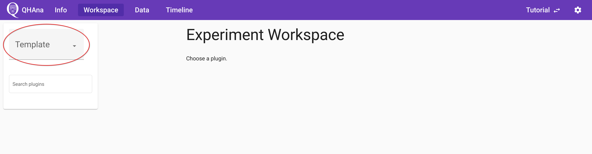

To display plugins, choose a template via the marked drop down menu.
For this small tutorial, choose the "Hello World" template.

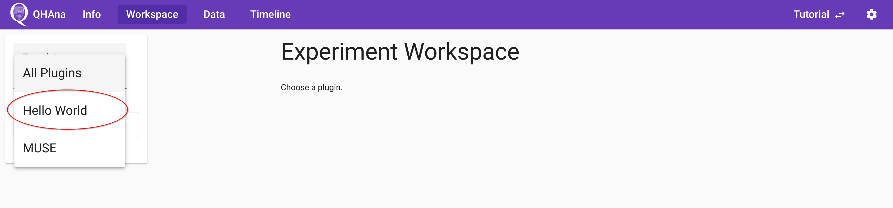

The list of all available plugins of this template can be found on the left.
If no plugin shows up, make sure that the plugin runner is running and configured in the setting spage of the QHAna UI (see [Settings](#settings)).
Select a plugin by clicking on its name in the list.

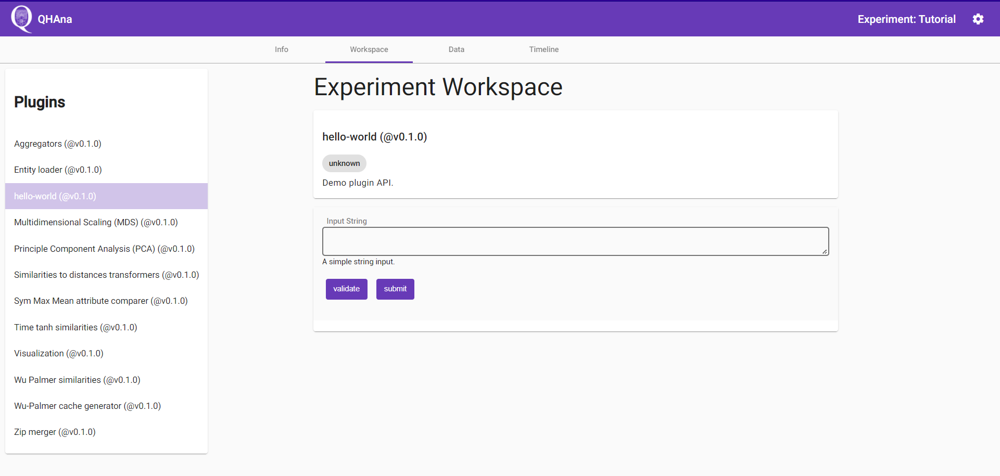

At the top of the workspace is the detailed plugin description.
The second card is the user interface of the plugin.
Different plugins can have different inputs.
For this tutorial we will be using the "hello world" plugin and input the text ``Tutorial input string.``.
The inputs can be validated with the "validate" button.
The "hello world" plugin accepts almost any input, but other plugins have stricter requirements.
Start the plugin by clicking on "submit".

On a successfull submit the QHAna UI shows the recorded experiment step and automaticallly polls for the finished results.
Once the results are available the UI will show the outputs generated by the plugin in the open timeline step.

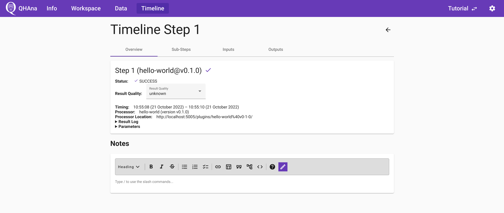

The finished timeline step can be supplemented with notes supporting markdown.
The notes are automatically saved while typing.
The quality of the computed result can be recorded with the special "Result Quality" field.

In the "Output" tab of the timeline step, the output of the "hello world" plugin is shown.
Every occurrence of "in" was replaced by "out".

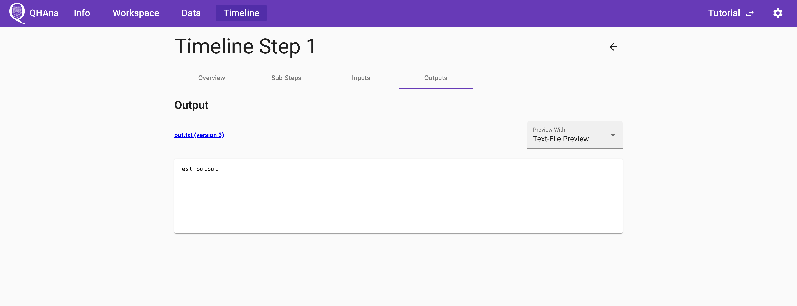

The title of the output directly links to the produced output data details page.
The page contains a download link and a preview.
It also lists in which step the data was produced in and which steps use this data as input.

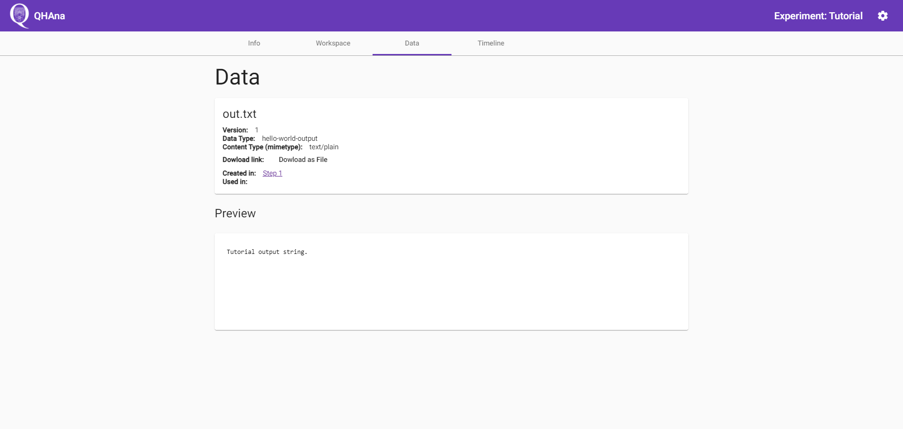

The data can also be found by navigating to the data tab and opening the specific data.
The produced data is sorted with the newest data at the top.
Data with the same filename creates new versions.

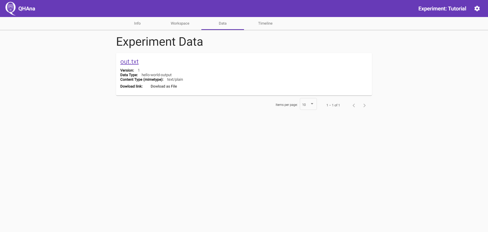

The timeline tab contains the whole list of timeline steps.
It is ordered by ascending step number, meaning that the first step is at the top.

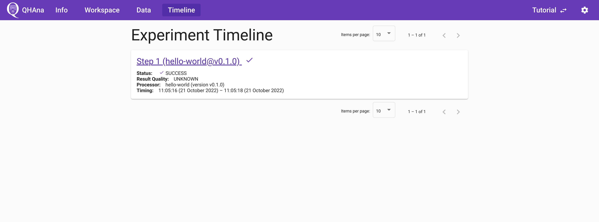


## Using the Mini MUSE dataset

If you have started QHAna together with the Mini MUSE database, you can take a look at the following documents on how to process the data with the available plugins.

Plugin sequence: {download}`PDF <pdfs/Mini_MUSE_Plugin_Sequence.pdf>`

Tutorial with screenshots: {download}`PDF <pdfs/Mini_MUSE_Plugin_Tutorial.pdf>`

## Next Steps

```{todo}
Describe and link to next steps
```
